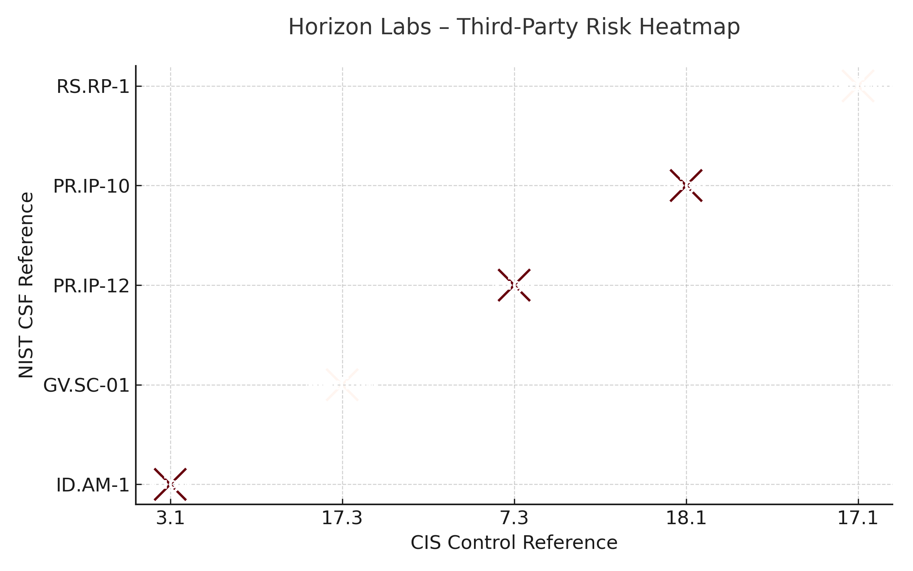

## 👋 Hi, I'm Jose

I'm a Librarian in Austin, Texas learning about Information Security and Privacy.  
<!--
---

## 🎓 Education

- **MA in Library and Information Science**

- **BA in English**
-->
---

## 🛡️ Certifications & Trainings
<!-- 
---

## 💼 Projects

---

# 🧩 Vendor Risk Summary Report  
**Vendor:** Horizon Labs  
**Client:** Oscorp Industries  
**Analyst:** Jose J. Ruiz-Vazquez  
**Assessment Type:** Third-Party Risk Assessment (TPRM)  
**Frameworks Applied:** NIST Cybersecurity Framework 2.0, CIS Controls v8  

## 🧾 Executive Summary

Horizon Labs, a SaaS provider handling sensitive scientific data for Oscorp Industries, completed a vendor security questionnaire.  
The review revealed several high- and medium-severity gaps in cybersecurity governance and technical controls.  
While the vendor shows awareness of security practices, the absence of formal frameworks and proactive testing increases the overall risk posture.

| Risk Area | Vendor Response (Excerpt) | Severity | NIST CSF Reference | CIS Control |
|------------|---------------------------|-----------|--------------------|--------------|
| **Sensitive data handled without clear classification or controls** | “The application handles confidential data. The data is stored in AWS S3 buckets …” | 🔴 **High** | **ID.AM-1** — Identify assets and data | **3.1** – Data protection management |
| **No formal cybersecurity framework or policy baseline** | “Horizon Labs is a startup; we still don’t follow any specific framework.” | 🟠 **Medium** | **GV.SC-01** – Establish governance structure | **17.3** – Establish and maintain a security policy |
| **No vulnerability management program** | “We don’t have a vulnerability scanner but we investigate incidents manually.” | 🔴 **High** | **PR.IP-12** – Vulnerability management | **7.3** – Remediate detected vulnerabilities |
| **No penetration testing program** | “We haven’t done a penetration test yet, but we plan to in the future.” | 🔴 **High** | **PR.IP-10** – Security testing | **18.1** – Establish a penetration testing program |
| **No documented incident response process** | “The IT team manages all incidents.” | 🟠 **Medium** | **RS.RP-1** – Response planning | **17.1** – Establish an incident response process |

## 📊 Risk Visualization

**Figure: Horizon Labs Third-Party Risk Heatmap**  
This heatmap visualizes the distribution of identified vendor risks by their corresponding **NIST CSF** and **CIS Controls** references.  
Each plotted point represents a key finding from Horizon Labs’ questionnaire, color-coded by severity.  
The clustering in the *Protect* and *Respond* domains highlights maturity gaps in vulnerability management, testing, and incident response.  
By aligning findings to frameworks, this visualization transforms qualitative responses into structured, actionable insight for risk reporting.

## 🧠 Analyst Commentary

- **Framework Integration:** Using NIST CSF as the primary taxonomy ensured clear mapping between governance, protection, and response functions.  
- **Control Maturity Gaps:** Horizon Labs’ lack of a structured vulnerability management and testing program indicates a reactive rather than preventive approach.  
- **Governance Observations:** The absence of a formal cybersecurity framework is common among small vendors but introduces consistency and accountability risks.  

## 📈 Recommended Next Steps

1. **Formalize Framework Adoption:** Encourage Horizon Labs to align with NIST CSF or ISO/IEC 27001 to establish baseline governance.  
2. **Implement a Vulnerability Management Tool:** Integrate regular scanning, patch tracking, and risk scoring.  
3. **Conduct Annual Penetration Testing:** Validate external and internal controls using independent assessors.  
4. **Develop an Incident Response Plan:** Include defined roles, escalation procedures, and testing cadence.  
5. **Integrate Vendor Oversight:** Add Horizon Labs to Oscorp’s vendor risk register and track progress quarterly.

## 🎓 Learning Reflection

- Translating qualitative responses into structured, framework-aligned findings demonstrated how **GRC frameworks operationalize vendor risk**.  
- Applying both NIST CSF and CIS Controls bridged **strategic governance** and **technical control specificity**, an essential skill for GRC and TPRM professionals.  
- Visualizing results reinforced how **data storytelling** supports executive decision-making in risk management.

## 🧩 References

- [NIST Cybersecurity Framework 2.0](https://www.nist.gov/cyberframework)  
- [CIS Controls v8](https://www.cisecurity.org/controls/cis-controls-list)  
- [NIST SP 800-30 Rev.1 – Guide for Conducting Risk Assessments](https://nvlpubs.nist.gov/nistpubs/Legacy/SP/nistspecialpublication800-30r1.pdf)  
- [Shared Assessments TPRM Toolkit](https://sharedassessments.org/toolkits/)  
- [ENISA Supply Chain Threat Landscape](https://www.enisa.europa.eu/publications/supply-chain-threat-landscape)

**Artifact Type:** Vendor Risk Summary Report  
**Estimated Effort:** 3–4 hours  
**Learning Focus:** Framework mapping, vendor risk assessment, executive reporting

---

### Google Cybersecurity Professional Certificate Portfolio Projects

**Controls and Compliance Auditing**

Executed a comprehensive **security audit** assessing an organization’s controls and compliance posture against **PCI DSS**, **GDPR**, and **SOC** frameworks. Identified key deficiencies such as weak access controls and lack of encryption, then delivered actionable recommendations including implementing an **IDS** and strengthening **password management**. This project demonstrates my ability to evaluate and enhance organizational compliance and risk posture through structured auditing practices.  
_Skills: Security Audit, Compliance Frameworks, Risk Assessment, PCI DSS, GDPR, SOC, Controls Testing_

**NIST CSF Incident Response Analysis (DDoS)**

Applied the **NIST Cybersecurity Framework (CSF)** to analyze and respond to a **Distributed Denial of Service (DDoS)** incident caused by an unconfigured firewall. Developed a structured action plan across all five CSF functions to strengthen network resilience, including improved firewall rules, traffic monitoring, and recovery protocols. This project highlights my ability to transform an incident into a comprehensive strategy for proactive defense and response.  
_Skills: NIST CSF, Incident Response, Network Security, Firewall Configuration, DDoS Mitigation_

**Linux File Authorization Management**

Ensured secure file and directory permissions for a research team by auditing access rights and enforcing the **Principle of Least Privilege** using Linux CLI tools. Utilized commands such as `ls -la` and `chmod` in both symbolic and octal notation to precisely manage file authorization. This project showcases my foundational skills in endpoint security and user access control within a Linux environment.  
_Skills: Linux Security, Access Control, Least Privilege, File Permissions, CLI Tools_

**Security Monitoring with SQL Filtering**

Developed and executed an **SQL query** to detect after-hours failed login attempts, addressing a critical security monitoring requirement. Leveraged SQL filtering techniques to isolate potential indicators of compromise within large datasets. This project demonstrates my ability to use data-driven methods for **incident detection and analysis** in support of cybersecurity operations.  
_Skills: SQL, Log Analysis, Incident Detection, Data Analytics, Security Monitoring_

**Proactive Risk Management**

Performed a full **vulnerability assessment** on a Linux/MySQL environment following the **NIST SP 800-30 Rev. 1**methodology. Identified open access permissions as a major risk and proposed layered mitigation strategies, including **MFA**, **RBAC**, **TLS encryption**, and **IP allow-listing**. This project illustrates my competence in proactive risk management and control design to minimize potential data exposure. 
_Skills: Risk Management, Vulnerability Assessment, NIST SP 800-30, Access Control, Encryption, MFA_

**Incident Detection, Analysis, and Documentation**

Simulated the **Incident Response Lifecycle** by documenting and analyzing multiple security incidents, including a ransomware attack. Employed **Wireshark**, **tcpdump**, and **VirusTotal** to detect, analyze, and classify threats across different security domains. This project highlights my proficiency in applying structured response frameworks and leveraging technical tools for threat analysis and documentation.  
_Skills: Incident Response, Threat Analysis, Wireshark, tcpdump, VirusTotal, Documentation_

**Python File Parsing**

Created a **Python script** to securely import and parse an allow list from a text file using the `with` statement for robust file handling. Ensured the script efficiently managed data for further security analysis or enforcement logic. This project demonstrates my ability to apply **Python programming** to automate and streamline data management tasks in cybersecurity contexts.  
_Skills: Python, File Parsing, Automation, Data Handling, Scripting_

---

### GRC Mastery Portfolio Projects

**CIA Triad Practical Assessment**

Conducted a **Confidentiality, Integrity, and Availability (CIA) assessment** for a high-value R&D project at Oscorp involving a sensitive medication formula. Developed targeted interview questions for the Chief Scientist to evaluate access control, file protection, version management, and system resilience. Provided actionable recommendations such as implementing **encryption, password protection, access restrictions**, and **regular backups** to strengthen the document’s security posture.  
_Skills: GRC, CIA Triad, Information Security, Risk Assessment, Data Protection, Security Controls_

**Cybersecurity Audit Program Design**

Developed a **cybersecurity audit program** for Oscorp based on the **Three Lines of Defense model**, ensuring periodic and structured testing of cybersecurity controls. Proposed role alignment where the internal team conducts self-audits (Line 1), a dedicated **Cybersecurity Auditor** provides independent oversight (Line 2), and an external audit firm performs comprehensive control testing (Line 3). This project demonstrates my ability to design sustainable audit governance frameworks that strengthen accountability and continuous improvement in cybersecurity assurance.  
_Skills: GRC, Cybersecurity Auditing, Three Lines of Defense, Internal Controls, Audit Program Design, Governance Frameworks_

**Asset Management Process Design**

Advised Oscorp on developing a structured **Asset Management process** to address audit findings and improve oversight of IT and research assets. Recommended evolving the existing spreadsheet into a formal **Configuration Management Database (CMDB)** through **asset discovery, validation with IT and research stakeholders**, and data classification by sensitivity and criticality. Established governance steps for periodic CMDB reviews, defined ownership by the IT team, and emphasized senior management support to maintain long-term accuracy and accountability.  
_Skills: GRC, Asset Management, CMDB, IT Governance, Risk Management, Data Classification, Audit Remediation_

**Identity and Access Management (IAM) Recommendations**

Performed an **IAM assessment** for Oscorp’s SQL database containing the organization’s most sensitive intellectual property — the proprietary medication formula. Identified excessive access permissions among research staff and concentrated administrative privileges. Proposed a comprehensive **IAM improvement plan** featuring **multi-factor authentication (MFA)**, **role-based access control (RBAC)**, **principle of least privilege**, and **separation of duties**, along with periodic access reviews to maintain compliance and oversight.  
_Skills: Identity and Access Management (IAM), RBAC, Principle of Least Privilege, Multi-Factor Authentication (MFA), Separation of Duties, Access Governance, Security Assessment_

**Cybersecurity Education and Awareness Program Evaluation**

Evaluated a **security awareness and phishing simulation platform** proposed to Oscorp’s CEO to strengthen defense against social engineering threats. Recommended **modernizing Oscorp’s outdated training module**, implementing **annual mandatory training**, and supplementing it with regular intranet articles on phishing, password hygiene, and malware. Advised conducting a **vendor comparison** process to assess multiple providers for functionality, cost, and user engagement before purchase.  
_Skills: Security Awareness, Phishing Simulation, Vendor Evaluation, Training Program Design, Human Risk Management, Cybersecurity Culture_

**Data Loss Prevention (DLP) and Insider Threat Program Design**

Developed a comprehensive **Insider Threat and Data Loss Prevention (DLP)** strategy for Oscorp following a suspected internal data leak. Recommended **blocking USB devices**, performing **data discovery and classification**using Microsoft Azure AIP, and implementing **Microsoft DLP policies** across SQL databases and SharePoint. Integrated DLP measures with existing IAM controls and promoted a culture of accountability to prevent insider threats.  
_Skills: Data Loss Prevention (DLP), Insider Threat Management, Data Classification, Azure Information Protection (AIP), IAM, Risk Mitigation, Security Governance_

**Cyber Incident Response Plan Development**

Created an enterprise-wide **Cyber Incident Response Plan (CIRP)** for Oscorp to formalize procedures for managing cyber crises. Leveraged the **VicGov Cyber Incident Response Plan template** and aligned it with **NIST incident handling phases**—detection, containment, eradication, recovery, and lessons learned. Defined stakeholder engagement, escalation, and communication workflows to establish a repeatable, tested framework for coordinated incident management.  
_Skills: Incident Response, NIST Framework, Crisis Management, Communication Planning, Stakeholder Engagement, Cybersecurity Governance, Policy Development_

**Third-Party Risk Management (TPRM) Assessment**

Performed a **third-party security assessment** of Horizon Labs, a SaaS provider supporting Oscorp’s scientific data analysis operations. Identified critical deficiencies including lack of a **dedicated cybersecurity function**, **vulnerability management**, and **incident response capability**, along with weak **IAM** practices. Summarized high-risk findings and presented mitigation recommendations to Oscorp’s senior leadership for strategic vendor risk oversight.  
_Skills: Third-Party Risk Management (TPRM), Vendor Risk Assessment, SaaS Security, Risk Analysis, IAM, Vulnerability Management, Incident Response_

**Vulnerability Management Program Enhancement**

Reviewed Oscorp’s recurring **vulnerability scan reports** and identified repeated findings in **Adobe**, **Chrome**, and **Safari** software across end-user systems. Recommended implementing a **software rationalization policy**, restricting application installations, and requiring business justification for exceptions. Strengthened the **vulnerability management lifecycle** through proactive patching, least privilege enforcement, and continuous compliance monitoring.  
_Skills: Vulnerability Management, Patch Management, Endpoint Security, Policy Development, Risk Mitigation, Access Control_

**Cybersecurity Program Design – NIST Framework Capstone**

Designed a comprehensive **three-year cybersecurity program** for Oscorp using the **NIST Cybersecurity Framework (CSF)** to address organizational gaps and maturity needs. Conducted a full current-state assessment revealing critical deficiencies in governance, risk management, IAM, and detection capabilities, then prioritized recommendations including establishing a **CISO role**, implementing **MFA**, deploying a **SIEM**, and launching **TPRM**and **data governance** initiatives. Delivered a structured roadmap aligning security objectives with NIST CSF functions (Identify, Protect, Detect, Respond, Recover).  
_Skills: NIST Cybersecurity Framework (CSF), Program Development, Risk Management, Governance, IAM, SIEM, Roadmap Planning, Cybersecurity Strategy_

**ISO 27001 Lead Auditor Training**

Completed the **ISO 27001 Lead Auditor Training** through GRC Mastery, developing a full **Information Security Management System (ISMS)** from the ground up. Built all core certification artifacts, including **risk assessments**, the **Statement of Applicability (SoA)**, and comprehensive **security policies and procedures** aligned with ISO 27001 clauses and Annex A controls. Gained hands-on experience applying **ISO 31000 Risk Management** and **ISO 19011 Audit Guidelines** while conducting simulated audits and achieving certification readiness.  
_Skills: ISO 27001, ISMS Development, Risk Assessment, Statement of Applicability (SoA), ISO 31000, ISO 19011, Audit Management, Policy Development_

---

### The Forage Security Job Simulations

**PwC US – Cybersecurity Consulting**

Conducted a **cybersecurity risk assessment** to identify control gaps and evaluate enterprise risk exposure. Produced a formal **Test of Design and Operating Effectiveness** document and a concise executive summary for stakeholders. This project demonstrates my capability to translate complex technical findings into clear, business-oriented risk insights.  
_Skills: Risk Assessment, Controls Testing, Audit Documentation, Business Communication_

**Deloitte Australia – Cyber Analyst Simulation**

Investigated a simulated **cyber breach** by performing forensic analysis on web activity logs to identify suspicious patterns and attack vectors. Mapped the incident timeline, assessed impact scope, and contributed actionable insights for containment. This project underscores my skills in **digital forensics** and structured investigative reporting.  
_Skills: Digital Forensics, Log Analysis, Incident Investigation, Threat Hunting_

**PwC US – Digital Assurance & Transparency**

Assessed the effectiveness of digital process controls within a simulated client engagement using structured workpapers and sample testing. Documented findings in a **deficiency analysis** outlining control design weaknesses and operational risks. This project highlights my understanding of **internal controls** and evidence-based audit methodologies.  
_Skills: Internal Controls, Audit Testing, Risk Analysis, Process Assessment_

**Commonwealth Bank – Introduction to Cybersecurity**

Developed **Splunk dashboards** to visualize fraud detection data and identify key behavioral trends. Conducted basic **penetration testing** and created actionable remediation recommendations to address identified vulnerabilities. This project emphasizes my applied skills in **threat detection**, incident response, and cybersecurity awareness communication.  
_Skills: Splunk, Data Visualization, Penetration Testing, Incident Response, Awareness Training_

**Mastercard – Security Awareness Analysis**

Analyzed **phishing campaign data** to identify organizational vulnerabilities and knowledge gaps in security awareness. Designed and proposed targeted **training initiatives** to strengthen user resilience against social engineering threats. This project highlights my ability to combine **threat intelligence** with **human-factor risk management**strategies.  
_Skills: Phishing Analysis, Security Awareness, Threat Intelligence, Training Design_

**AIG – Shields Up Cyber Defense Simulation**

Executed a **cyber threat analysis** leveraging **CISA** advisories to document system vulnerabilities and propose mitigations. Used **Python** to develop an ethical hacking script simulating brute-force decryption for data recovery, reinforcing hands-on technical skills. This project demonstrates my capability to blend **threat research**, automation, and clear incident communication for effective defense.  
_Skills: Threat Analysis, Python, Vulnerability Research, Automation, Cyber Defense_

---

### SANS AIS247: AI Security Essentials for Business Leaders Portfolio Project

This project applies the governance and risk management principles from **SANS AIS247: AI Security Essentials for Business Leaders™** to the public library context. It explores how responsible AI adoption can align with public sector ethics, privacy, and transparency. The portfolio emphasizes **AI governance, data protection, and organizational readiness**, bridging the worlds of cybersecurity GRC and library information ethics.

**Responsible AI Governance in Public Libraries**

Developed a **Responsible AI Governance Framework** inspired by the **SANS AIS247: AI Security Essentials for Business Leaders™** course, applying AI risk and ethics principles to public library environments. Designed policies and risk controls aligned with the **NIST AI Risk Management Framework** to guide ethical AI adoption, focusing on data privacy, transparency, and public trust. Produced practical deliverables including an **AI Acceptable Use Policy**, risk register, and maturity model to help libraries implement secure and equitable AI governance.  
_Skills: AI Governance, Responsible AI, NIST AI RMF, Policy Development, Data Ethics, Risk Management, Public Sector GRC_

**Deliverables Summary:**

- **Responsible AI Governance Framework** mapped to NIST AI RMF principles
- **AI Acceptable Use Policy (AUP)** for staff and patron AI tool usage
- **AI Risk Register & Maturity Model** for assessing readiness and control effectiveness

---

### SANS SEC366: CIS Implementation Group 1 Portfolio Projects

This portfolio showcases a series of **hands-on cybersecurity projects** completed as part of the **SANS SEC366: CIS Implementation Group 1™** course. Each project focuses on implementing and validating foundational **CIS Critical Security Controls**, demonstrating practical experience across governance, protection, detection, response, and recovery functions. Together, these projects highlight my ability to apply structured, risk-informed approaches to cybersecurity management in **resource-constrained and public sector environments**, bridging operational controls with strategic GRC principles.

**CIS Control 01–02: Foundational Asset Management**

Implemented **CIS Controls 01 and 02** by building a structured **hardware and software asset inventory** to improve visibility and reduce unmanaged risk in a small organizational environment. Leveraged automated discovery tools to identify unauthorized devices, created standardized naming conventions, and aligned results with CIS IG1 Safeguards for asset tracking and configuration control. This project demonstrates practical skills in establishing **baseline configuration management**, governance reporting, and risk reduction through accurate asset visibility.  
_Skills: CIS Controls, Asset Management, Baseline Configuration, Governance, Risk Reduction, Cyber Hygiene, IT Asset Inventory_

**Deliverables Summary:**

- **Hardware and Software Asset Inventory Spreadsheet** with key attributes (owner, system type, last verified)
- **Configuration Baseline Checklist** aligned with CIS IG1 Safeguards
- **Governance Report** summarizing asset discovery findings and remediation priorities

**CIS Control 04–07: Secure Configuration and Access Management**

Implemented **CIS Controls 04 through 07** to strengthen endpoint and account security through **secure configuration management** and **access control enforcement**. Developed baseline configuration templates for common systems, enforced **least privilege principles**, and established a workflow for privileged access requests and periodic account reviews. This project demonstrates the practical application of CIS IG1 safeguards to harden environments against common attacks and reduce risk from misconfiguration and excessive user permissions.  
_Skills: CIS Controls, Secure Configuration, Access Management, Least Privilege, Privileged Access, Risk Mitigation, System Hardening_

**Deliverables Summary:**

- **System Configuration Baseline Template** documenting secure settings for endpoints and servers
- **Access Control Policy** defining least-privilege standards and approval workflows
- **User Access Review Checklist** for periodic privilege validation and compliance reporting

**CIS Control 08: Audit Log Management**

Implemented **CIS Control 08** by establishing centralized **audit log collection, retention, and analysis** processes to enhance visibility into system and user activity. Configured endpoint and server logs to forward critical security events to a central repository and developed review procedures to identify anomalies such as unauthorized access or failed logins. This project demonstrates the ability to operationalize **detection and monitoring controls** that improve threat visibility and support incident response readiness in resource-constrained environments.  
_Skills: CIS Controls, Audit Log Management, Monitoring, Detection, Incident Response, Security Operations, Governance_

**Deliverables Summary:**

- **Centralized Log Collection Procedure** detailing configuration, retention, and review frequency
- **Audit Log Review Template** for documenting findings and escalation paths
- **Anomaly Detection Checklist** identifying high-priority events for investigation

**CIS Control 17: Incident Response Readiness**

Implemented **CIS Control 17** by developing a structured **incident response plan (IRP)** tailored for small organizations with limited security resources. Created clear procedures for incident identification, escalation, containment, and communication, aligned with the **NIST Incident Response Lifecycle**. This project demonstrates practical experience in establishing repeatable response workflows, defining stakeholder roles, and enabling timely decision-making during security events.  
_Skills: CIS Controls, Incident Response, NIST Framework, Crisis Management, Escalation Procedures, Communication Planning, Governance_

**Deliverables Summary:**

- **Incident Response Plan (IRP) Document** outlining detection, response, and recovery phases
- **Incident Reporting Form** with defined escalation contacts and timeframes
- **Tabletop Exercise Script** for testing and improving organizational readiness

**CIS Controls 11 & 12: Data Recovery and Backup Management**

Implemented **CIS Controls 11 and 12** by developing a structured **backup and data recovery program** to ensure business continuity and minimize data loss risks. Designed and tested automated backup routines for critical data, verified restoration integrity, and documented clear recovery time objectives (RTOs) and recovery point objectives (RPOs). This project demonstrates the ability to operationalize CIS IG1 safeguards for resilience, ensuring that essential information and systems can be restored reliably after incidents.  
_Skills: CIS Controls, Data Recovery, Backup Management, Business Continuity, Disaster Recovery, Resilience, Governance_

**Deliverables Summary:**

- **Backup and Recovery Policy** outlining frequency, storage locations, and validation procedures
- **Backup Verification Checklist** confirming successful restoration tests and data integrity
- **Recovery Time/Point Objective (RTO/RPO) Matrix** documenting critical system recovery priorities

**CIS IG1 Metrics Dashboard and Reporting**

Developed a **CIS Implementation Group 1 (IG1) metrics dashboard** to measure control implementation progress and communicate cybersecurity posture to leadership. Designed quantitative and qualitative indicators across the **Govern, Identify, Protect, Detect, Respond, and Recover** functions, using visual scoring to highlight maturity and residual risk. This project demonstrates the ability to translate technical control data into **business-focused reporting**for informed decision-making and continuous improvement.  
_Skills: CIS Controls, Metrics and Reporting, GRC, Risk Measurement, Program Maturity, Governance, Executive Communication_

**Deliverables Summary:**

- **CIS IG1 Metrics Dashboard (Spreadsheet or Visualization Tool)** tracking safeguard completion and risk reduction
- **Executive Summary Report** presenting control maturity and recommended next steps
- **Continuous Improvement Tracker** documenting periodic reassessments and score updates

---

## 🧠 Trainings
-->
**Antisyphon Training**
- Getting Started in Packet Decoding
- SOC Core Skills
- Getting Started in Security with BHIS and MITRE ATT&CK
- Active Defense and Cyber Deception
- MITRE ATT&CK Framework and Tools
- Foundational Application Security Training
- Professionally Evil ICS & OT Fundamentals
- Workshop: Introduction to Cloud Security
- Workshop: Exploiting AI
- Workshop: Investigating M365 Business Email Compromise
- Workshop: Intro to Virtualization
- Workshop: Introduction to IP Network

**arcX**
- Cyber Threat Intelligence 101

**Blue Team Labs Online**
- Phishing Analysis
- Phishing Analysis 2

**CompTIA**
- CompTIA Security+

**Coursera**
- Google Cybersecurity Certificate

**Fortified Logic**
- ICS101 - Introduction to ICS

**GRC Mastery**
- GRC Mastery
- ISO/IEC 27001:2022 Lead Auditor

**IriusRisk**
- IriusRisk - Threat Modeling Champion (IR-TMC)

**ISC2**
- Certified in Cybersecurity (CC)

**Kase Scenarios**
- Orkla: Dragon Con

**LetsDefend**
- Phishing Analyzer

**LinkedIn Learning**
- Advanced SOC 2 Auditing: Proven Strategies for Auditing the Security, Availability and Confidentiality TSCs
- SOC 2 Compliance Essential Training
- Cybersecurity Foundations: Governance, Risk, and Compliance (GRC)
- Navigate SOC 2 Compliance in the Cloud
- Introduction to AWS Threat Detection
- Governance, Risk, and Compliance (GRC) for the Cloud-Native Revolution
- Deep Dive into Open-Source Intelligence
- Cyber Asset Management: Securing Digital Resources in the Modern Enterprise
- Leveraging AI for Governance, Risk, and Compliance
- Building a HIPAA Compliance Program
- Cybersecurity Audit and Assessment Fundamentals for GRC Analysts: From Vendor Risk to Incident Coordination
- Cybersecurity Careers: Become an Identity and Access Management Manager

**My OSINT Training**
- Introduction to OSINT

**Oracle**
- Oracle Cloud Infrastructure 2023 AI Certified Foundations Associate

**Pluralsight**
- Governance, Risk and Compliance (GRC) Skill Path

**Qualys**
- Vulnerability Management Foundation
- Vulnerability Management, Detection, and Response

**SANS Institute**
- AIS247: AI Security Essentials for Business Leaders
- SEC366: CIS Implementation Group 1

**Simply Cyber**
- Introduction to Hacking Methodology
- GRC Jumpstart: GRC Foundations in Modern Cybersecurity
- Cyber Resilience Fundamentals

**TCM Security**
- Linux 101
- Python 101 for Hackers
- Programming with AI - Mini Course
- The Definitive GRC Analyst Master Class

**TryHackMe**
- Introduction to Cyber Security Learning Path
- Pre Security Learning Path

___
<!--
## Experience

___

## Austin Public Library

**Library Assistant Manager**
*May 2023 – Present (2 years, 6 months)*

* Supervise daily operations and an 8-person team, ensuring adherence to internal procedures and data-handling standards.
* Lead digital literacy programs that strengthen community awareness of cybersecurity and data privacy practices.
* Maintain secure facility and system environments aligned with access control, risk management, and incident response principles.
* Champion transparency and accountability in operations—values directly applicable to information governance and compliance culture.

**Administrative Senior**
*May 2016 – May 2023 (7 years, 1 month)*

* Oversaw scheduling, vendor coordination, and system workflows, ensuring policy compliance, audit-readiness, and documentation of internal controls.
* Managed sensitive patron and staff data across internal systems, prioritizing integrity, confidentiality, and availability.
* Served as point of contact for vendor management and incident resolution, incorporating third-party risk awareness.
* Implemented documentation and internal control improvements that enhanced operational continuity and compliance tracking.

---

## Kyle Public Library

**Library Assistant**
*October 2015 – May 2016*

* Developed and taught technology classes to the public, acting as a primary educator for digital tools and safe online practices.
* Managed social media content and the library homepage, implementing content strategies to manage reputation and communication risk.
* Assisted patrons, handled circulation tasks, and contributed to collection management.

---

## Health Tech Hatch

**Editor**
*December 2012 – July 2015*
*(Content Policy, Quality Assurance, and Third-Party Management)*

* Led the curation and publishing process for online content, ensuring quality, tone, and compliance with editorial policy.
* Managed relationships with content contributors and advertisers, demonstrating contract coordination and communication skills essential for third-party risk assessment.
* Executed SEO and website maintenance tasks focused on site health, performance, and digital hygiene best practices.

---

## Iowa City Public Library

**Reference & Instruction Assistant**
*January 2012 – May 2013*
*(Compliance, Instruction, and Information Access)*

* Designed and delivered technology training programs focused on digital literacy and online safety.
* Coordinated distribution of tax forms and assistance, handling sensitive and high-compliance documentation.
* Managed Interlibrary Loan (ILL) processes in strict adherence to external protocols and standards.

---

## The WiderNet Project

**Digital Librarian**
*January 2012 – September 2012*
*(Information Governance and Legal Compliance)*

* Identified, selected, and curated digital resources for wide distribution, ensuring content quality and relevance.
* Conducted copyright and permissions acquisition, mitigating legal risk and ensuring proper licensing.
* Implemented systematic methods for cataloging and organizing complex digital assets for global access.

---

## Texas Legislative Council

**Proofreader**
*September 2004 – May 2009 (intermittent)*
*(Auditing, Quality Control, and Policy Adherence)*

* Performed proofreading and quality assurance on legislative documents, ensuring fidelity to grammar, content, and legal standards.
* Operated within a three-person review system to ensure accuracy of lengthy documents.
* Frequently served as the senior member of the proofreading team, mentoring colleagues.
* Gained in-depth knowledge of legislative processes and collaborated with law librarians and editors.

---

## 802 NE 1st

**Project Manager / Litigation & Research Consultant**
*June 2005 – March 2011 (intermittent)*
*(TPRM, Risk Management, and Project Coordination)*

* Conducted complex research in environmental policy and natural resource litigation.
* Managed construction of a specialized research facility, aligning safety and scientific requirements.
* Built and maintained databases for litigation support and performed legal research.
* Provided English–Spanish translation and live interpretation for legal teams.
* Performed bookkeeping and payroll functions, ensuring financial accuracy and transparency.

---

## Mind Matters Toys

**Cashier / Operations Support**
*March 2001 – July 2003*
*(Retail Management, Training, and Inventory Control)*

* Oversaw inventory management, scheduling, and cash handling operations.
* Trained and onboarded new employees, emphasizing system proficiency and workplace culture.
* Initiated and executed security improvements, including camera installation.
* Participated in hiring and team-building decisions.

---

## MCI WorldCom

**Telemarketer**
*December 2000 – March 2001*
*(Sales, Resilience, and Communication)*

* Managed high-volume outbound calls while maintaining professionalism and persistence.
* Consistently met daily quotas in a high-pressure sales environment.
* Developed persuasive communication and rapid information delivery skills.

---

## Lindhart Labs (Iowa Biosciences Advantage Program)

**Laboratory Assistant**
*May 1999 – May 2000*
*(Technical Acumen, Research Support, and Information Access)*

* Provided lab assistance on research focused on heparin chemistry.
* Acted as liaison between lab and university libraries for research retrieval.
* Located and delivered essential research materials from specialized collections.
* Developed early digital research and presentation skills.

---

## Private Chemistry Tutor

**Independent Tutor**
*1997 – 1998 School Years*
*(Instructional Design, Mentorship, and Gap Analysis)*

* Developed and delivered personalized one-on-one chemistry instruction.
* Diagnosed learning gaps and tailored lessons accordingly.
* Operated a sole-proprietor tutoring service based on client referrals.

---

## Jane Stern Dorado Community Library

**Library Aide**
*June 1998 – July 1998*
*(Customer Service, Organization, and Operational Support)*

* Staffed the circulation desk, assisting patrons and processing transactions.
* Shelved materials accurately and maintained physical organization.
* Repaired and preserved library materials.
* Completed a structured municipal summer work program demonstrating reliability.

---
-->
